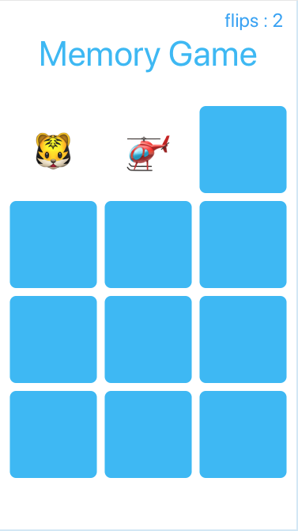
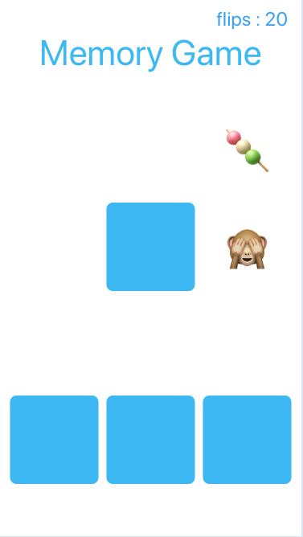

## Playground: Emoji Memory Game

This is the final project for [the certificate](https://multitudes.github.io/images/hacking%20with%20swift%20certificate.jpg) of the [100 Days of Swift](https://www.hackingwithswift.com/100) by [Paul Hudson](https://twitter.com/twostraws). The challenge was to create a memory pairs game that has players find pairs of cards – it’s sometimes called Concentration, Pelmanism, or Pairs.  
I coded it in Xcode Playgrounds for mac using the Live View. 

I enjoyed doing the project. It has not been trivial and I used emojis for the cards. To do so I had to convert a font or character to an image with a string extension. Many things in this project have required careful consideration. For fun, I have emoji confetti to be shown when the game ends and made extensive use of iOS animations.

 
 

  &nbsp;&nbsp;&nbsp;&nbsp;&nbsp;&nbsp;
  &nbsp;&nbsp;&nbsp;&nbsp;&nbsp;&nbsp;
&nbsp;&nbsp;&nbsp;&nbsp;&nbsp;&nbsp;

  
